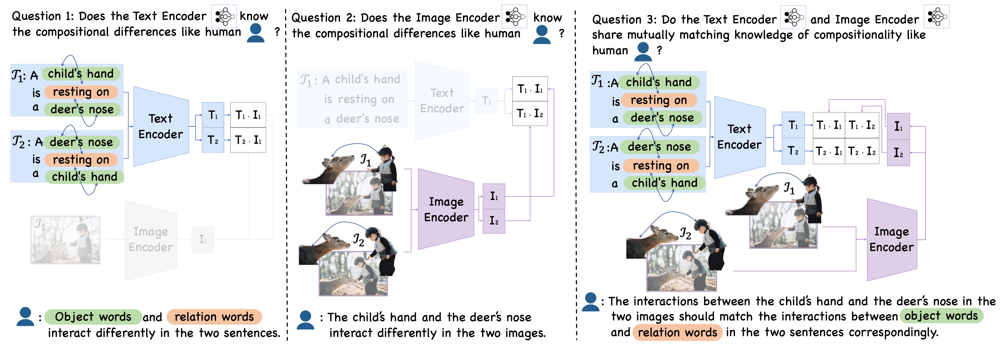

# Diagnosing the Compositional Knowledge of Vision Language Models from a Game-Theoretic View

This repo includes the authors' [Pytorch](https://pytorch.org/) implementation of the paper:

#### [Diagnosing the Compositional Knowledge of Vision Language Models from a Game-Theoretic View](https://arxiv.org/pdf/2405.17201)

[[arxiv](https://arxiv.org/pdf/2405.17201)]

## Introduction

Compositional reasoning capabilities are usually considered as fundamental skills to characterize human perception. Recent studies show that current Vision Language Models (VLMs) surprisingly lack sufficient knowledge with respect to such capabilities. To this end, we propose to thoroughly diagnose the composition representations encoded by VLMs, systematically revealing the potential cause for this weakness. Specifically, we propose evaluation methods from a novel game-theoretic view to assess the vulnerability of VLMs on different aspects of compositional understanding, e.g., relations and attributes. Extensive experimental results demonstrate and validate several insights to understand the incapabilities of VLMs on compositional reasoning, which provide useful and reliable guidance for future studies.



## Updates

- [x] [09/2024] release the text-part code for [CLIP](https://github.com/openai/CLIP).
- [ ] text-part code for other VLMs
- [ ] image-part code for other VLMs
- [ ] text&image-part code for other VLMs

## Dependencies

* Python 3 >= 3.8
* Pytorch >= 2.1.0
* OpenCV >= 4.8.1.78
* Scipy >= 1.10.1
* NumPy >= 1.24.3

## Data Preparation

Download the VG_relation dataset to *./data* from [here](https://github.com/mertyg/vision-language-models-are-bows?tab=readme-ov-file).

## Evaluations

To evaluate the model performance, please run: 

```
python3 inference.py
```

## Acknowledgements

- [ARO](https://openreview.net/pdf?id=KRLUvxh8uaX)

## Contact

If you have any questions, please feel free to contact me via wj0529@connect.hku.hk.